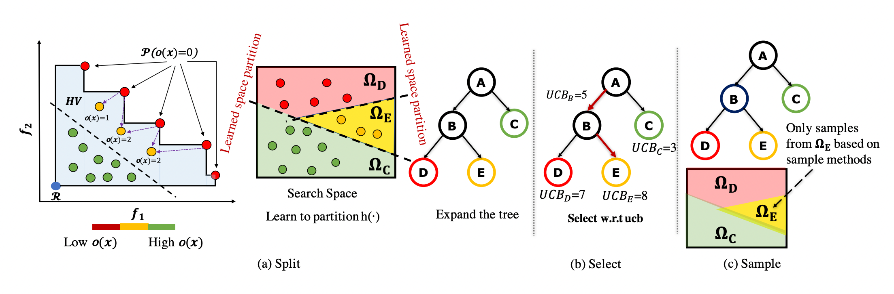

# MULTI-OBJECTIVE OPTIMIZATION BY LEARNING SPACE PARTITIONS (LaMOO)

LaMOO is a novel multi-objective optimizer that learns a model from observed samples to partition the search space and then focus on promising regions that
are likely to contain a subset of the Pareto frontier. So that existing solvers like Bayesian Optimizations (BO) can focus on promising subregions to mitigate the over-exploring issue.

<p align="center">

</p>


## Environment Requirements
```
python >= 3.8, PyTorch >= 1.8.1, gpytorch >= 1.5.1
scipy, Botorch, Numpy, cma
```
### Extra Requirements for [Molecule Discovery](./molecule/)
```
networkx, RDKit >= 2019.03, Chemprop >= 1.2.0, scikit-learn==0.21.3
```
Please follow the installation instructions [here](./molecule/moo_molecule_funcs/hgraph2graph/README.md)(including the Chemprop installation https://chemprop.readthedocs.io/en/latest/installation.html, using version ==1.2.0). Then go to [this folder](./molecule/moo_molecule_funcs/hgraph2graph/) with pip install -e . . If there is cuda unavailable on your side, you can delete all the .cuda() conversions in this [directory](./molecule/moo_molecule_funcs/hgraph2graph/hgraph/). 

## Run LaMOO in different test functions 

Open the folder corresponding to the problem's name (including [branincurrin](./branincurrin/), [vehiclesafety](./vehiclesafety/), [Nasbench201](./nasbench/), [molecule](./molecule/), [molecule_obj3](./molecule_obj3/), and [molecule_obj4](./molecule_obj4/)). 

### Evaluate Bayesian Optimization with LaMOO as meta-booster. 

```
python MCTS.py --data_id 0
```

You can change the data_id with different initializations to have different runs. All the data come from differnet trials random sampling in the search space. 


## How to use LaMOO to optimize your own problems? 

You are able to run your own problems [here](./LaMOO/) by following several steps below.

1. Please wrap your own function [here](./LaMOO/problem.py) and follow the defination and format of this class to customize your own function. Here is an example:
```
class MyProblem:
    _max_hv = None    ## Type the maximum hypervolume here if it is known
    def __init__(self, dims:int, num_objectives:int, ref_point:torch.tensor, bounds:torch.tensor):
        self.dim = dims                         # problem dimensions, int
        self.num_objectives = num_objectives    # number of objective, int
        self.ref_point = ref_point              # reference point, torch tensor
        self.bounds = bounds                    # bound for dimensions, torch.tensor

        #### Take two dimensions problem for example
        # bounds = [(0.0, 0.99999)] * self.dim
        # self.bounds = torch.tensor(bounds, dtype=torch.float).transpose(-1, -2)

    def __call__(self, x):
        res = MyProblem(x)                      # Here is to customize your function
        return res
```

2. We already pluged this class in our optimizer in MCTS.py and you are also free to initialize your function in MCTS.py line 561. Note that we only support to maximize f(x). If you would like to minimize f(x), please add a negative operator on your function. 


## How to tune LaMOO? 
###  **Cp**: exploration factor 
> python MCTS.py --cp "your value"

> We usually set Cp = 0.1 * max of Hypervolume of the problem . 

> Cp controls the balance of exploration and exploitation. A larger Cp guides LaMOO to visit the sub-optimal regions more often.  a "rule of thumb" is to set the Cp to be roughly 10% of the maximum hypervolume. When maximum hypervolume is unknown, Cp can be dynamically set to 10% of the hypervolume
of current samples in each search iteration. 

###  **Node selection method**: Path(mcts) or Leaf
> python MCTS.py --node_select "mcts"/"leaf"

> Path: Traverse down the search tree to trace the current most promising search path and select the leaf node(Algorithm 1 in the paper).  
> Leaf: LaMOO directly select the leaf node with the highest UCB value(Algorithm 2 in the paper). This variation may reduce the optimization cost escipally for the problem with large numbers of objectives. 

###  **SVM kernel**: the type of kernels used by SVM

> python MCTS.py --kernel "linear"/"poly"/rbf

> From our experiments, we find that the RBF kernel performs slightly better than others. Thanks to the non-linearity of the polynomial and RBF kernels, their region partitions perform better compared to a linear one.

### Other possible tunable parameters

> --degree (svm degree) 

> --gamma ([defination](https://scikit-learn.org/stable/modules/generated/sklearn.svm.SVC.html))

> Leaf Size (Control the speed of tree growth, set [here](https://github.com/aoiang/LaMOO/blob/master/LaMOO/MCTS.py#L69))

> --sample_num (sample numsbers per iteration)

## Paper
Please reference the following publication when using this package. OpenReview <a href="https://openreview.net/pdf?id=FlwzVjfMryn">link</a>.
```
@inproceedings{
zhao2022multiobjective,
title={Multi-objective Optimization by Learning Space Partition},
author={Yiyang Zhao and Linnan Wang and Kevin Yang and Tianjun Zhang and Tian Guo and Yuandong Tian},
booktitle={International Conference on Learning Representations},
year={2022},
url={https://openreview.net/forum?id=FlwzVjfMryn}
}
```

